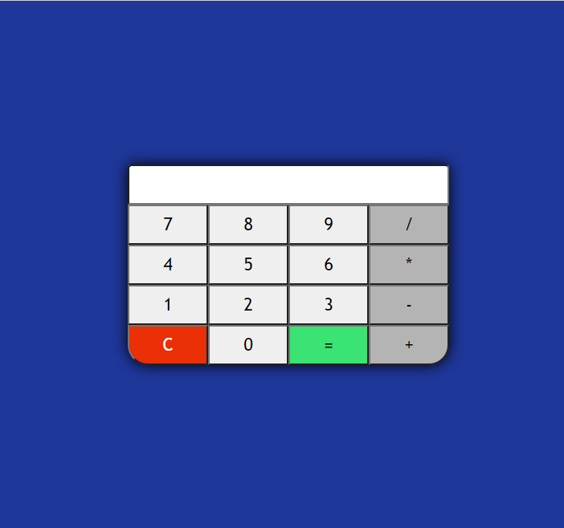

<h1 align="center">Calculadora JavaScript</h1>
<h1 align="center"></h1>

<hr>

### 📚 Sobre

Pequeno projeto - Calculadora feita para fixação de conteúdo JavaScript.

### 🎨 Detalhe

Foi utilizado diversos componentes tanto de estilização quanto de mecânica no JavaScript.

<hr>

### 🔥 Como contribuir

```
Fork este respositório
Faça as mudanças
Abra um pull request
```

### 💻 Tecnologias utilizadas

Nesta Calculadora Javascript foram utilizadas as seguintes tecnologias

- [HTML](https://www.w3schools.com/html/)
- [CSS](https://www.w3schools.com/css/)
- [JavaScript](https://www.w3schools.com/js/)

### :airplane: Acesse o projeto

Hospedado no Netlify

https://calculadora-gsj.netlify.app/
